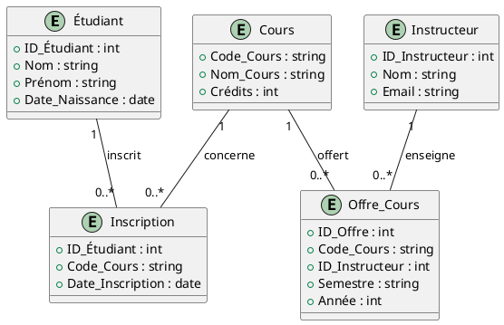

# Introduction aux Diagrammes Entité-Association

Un diagramme entité-association (E-A) est un outil graphique utilisé pour
modéliser les données et les associations entre elles dans un système
d'information. Il est couramment utilisé dans la conception de bases de données
pour représenter les entités, leurs attributs et les associations entre ces
entités. Ce type de diagramme aide à visualiser la structure de la base de
données et à comprendre comment les données sont interconnectées.

## Composants d'un Diagramme Entité-Association

1. **Entités** : Représentées par des entitys, les entités sont des objets ou
   concepts du monde réel ayant une existence indépendante. Par exemple, dans
   une base de données universitaire, des entités peuvent être Étudiant, Cours,
   et Instructeur.

2. **Attributs** : Représentés par des ovales, les attributs sont des propriétés
   ou caractéristiques des entités. Par exemple, un Étudiant peut avoir des
   attributs comme ID_Étudiant, Nom, et Date_Naissance.

3. **Associations** : Représentées par des losanges, les associations décrivent
   comment les entités sont liées entre elles. Par exemple, une relation
   Inscription peut lier les entités Étudiant et Cours.

4. **Cardinalité** : La cardinalité spécifie le nombre d'occurrences d'une
   entité qui peuvent être associées à une occurrence d'une autre entité. Les
   types de cardinalité courants sont :
    - Un à Un (1:1)
    - Un à Plusieurs (1:N)
    - Plusieurs à Plusieurs (M:N)

## Exemple de Diagramme Entité-Association

Voici un exemple de diagramme E-A pour une base de données universitaire, au
format PlantUML.

Code PlantUML

### Explication du Diagramme

- **Étudiant** : Entité représentant un étudiant, avec des attributs comme
  ID_Étudiant, Nom, Prénom, et Date_Naissance.
- **Cours** : Entité représentant un cours, avec des attributs comme Code_Cours,
  Nom_Cours, et Crédits.
- **Instructeur** : Entité représentant un instructeur, avec des attributs comme
  ID_Instructeur, Nom, et Email.
- **Inscription** : Relation entre Étudiant et Cours, avec des attributs comme
  ID_Étudiant, Code_Cours, et Date_Inscription.
- **Offre_Cours** : Relation entre Cours et Instructeur, avec des attributs
  comme ID_Offre, Code_Cours, ID_Instructeur, Semestre, et Année.

## Conclusion

Les diagrammes entité-association sont des outils précieux pour la modélisation
des bases de données. Ils permettent de représenter visuellement les entités,
leurs attributs et les Associations entre elles, facilitant ainsi la
compréhension et la conception de la structure de la base de données. Utiliser
des outils comme PlantUML pour créer ces diagrammes peut aider à standardiser et
à automatiser le processus de modélisation.

-------
<small>
   <cite>
      **Note** : Page rédigée en partie avec l'aide d'un assistant IA, principalement
      à l'aide de Perplexity AI, avec les LLM `GPT-4 Omni` et `Claude 3.5 Sonnet`. L'IA
      a été utilisée pour générer des explications, des exemples et/ou des suggestions de
      structure. Toutes les informations ont été vérifiées, éditées et complétées par
      l'auteur.
   </cite>
</small>