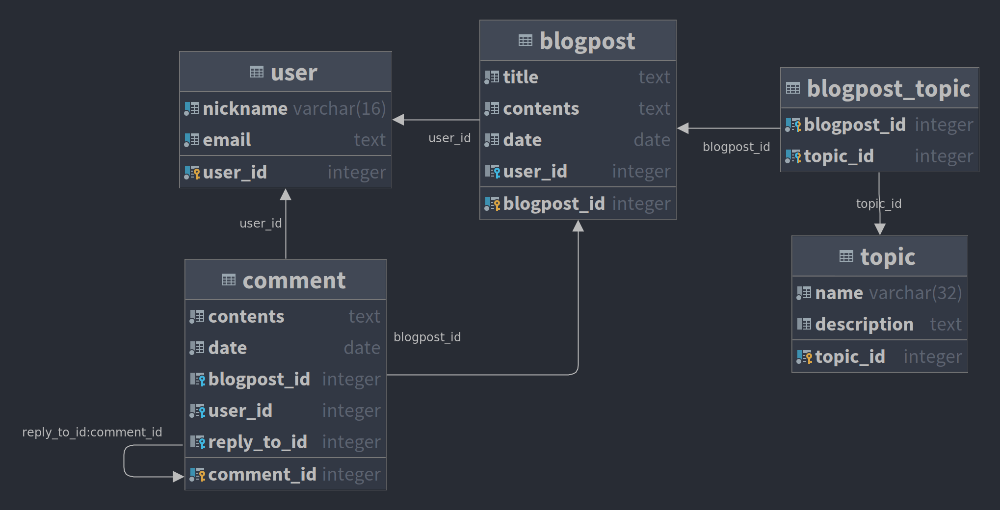

# Requêtes récursives

## Syntaxe PostgreSQL

- Syntaxe de
  base ([https://www.postgresqltutorial.com/postgresql-recursive-query/](https://www.postgresqltutorial.com/postgresql-recursive-query/)) :

```sql
WITH RECURSIVE cte_name AS (CTE_query_definition -- terme non récursif
    UNION [ALL]
    CTE_query_definition -- terme récursif
)
SELECT *
FROM cte_name;
```

- CTE : *common table expression* (expression de table commune)
- Étant donné que les requêtes récursives sont (bien sûr) récursives, nous avons
  besoin d'un *cas de base*, appelé ici un *terme non récursif*
- Ensuite, nous avons besoin d'un ou plusieurs termes récursifs
- `with recursive` fonctionne, au début, un peu comme les requêtes `with` (
  sans `recursive`)
- Il évaluera d'abord le terme non récursif pour initialiser l'ensemble des
  résultats
- Ensuite, il commencera à évaluer le terme récursif plusieurs fois, en boucle,
  jusqu'à ce qu'aucune nouvelle ligne ne soit ajoutée aux résultats
- chaque fois qu'il évalue le terme récursif, il essaiera d'ajouter de nouvelles
  lignes à l'ensemble des résultats
- le terme récursif est corrélé au `cte_name`

## Exemple sur la base de données du blog



- Nous voulons trouver toutes les réponses à un commentaire donné de manière
  récursive
- nous ne voulons pas seulement les réponses directes, mais aussi toutes les
  réponses des réponses
- Première tentative pour récupérer uniquement les réponses directes :

```sql
set search_path to blog3;
select comment_id, contents, reply_to_id, user_id
from comment
where blogpost_id = 1
  and reply_to_id is null;
```

- Pour obtenir les réponses aux réponses, nous devons utiliser la
  syntaxe `with recursive` décrite ci-dessus :

```sql
with recursive replies as (select comment_id, contents, reply_to_id, user_id
                           from comment
                           where reply_to_id = 1
                           union
                           select comment.comment_id,
                                  comment.contents,
                                  comment.reply_to_id,
                                  comment.user_id
                           from comment
                                    inner join replies
                                               on replies.comment_id = comment.reply_to_id)
select *
from replies;
```

- Si nous devons inclure le commentaire original avec lequel nous commençons
  dans le résultat, nous avons besoin d'un terme non récursif légèrement
  différent
- utiliser `comment_id = 1` au lieu de `reply_to_id = 1`
- Si nous devons inclure les commentaires commençant par un article de blog,
  nous avons besoin d'un terme non récursif légèrement différent...
- utiliser `blogpost_id = 1` au lieu de `reply_to_id = 1`

```sql
with recursive replies as (select comment_id, contents, reply_to_id, user_id
                           from comment
                           where blogpost_id = 1
                           union
                           select comment.comment_id,
                                  comment.contents,
                                  comment.reply_to_id,
                                  comment.user_id
                           from comment
                                    inner join replies
                                               on replies.comment_id = comment.reply_to_id)
select *
from replies;
```