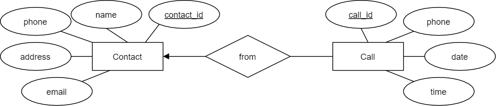
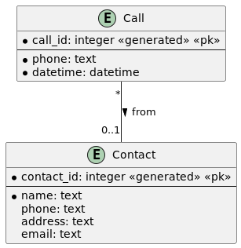
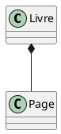
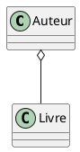

# Modélisation Entité-Association

- *Modèle de données relationnel* (ou *modèle relationnel*)
- *Modèle Entité-Association* (ou *Modèle EA*)
- Exemples

## Modèle Relationnel

- **Relation (table)** : table à deux dimensions, ensemble (et non liste) de
  tuples
- **Attributs** : colonnes de la table, champs
- **Schéma** : `Movies(title, year, length, filmType)`
- **Tuples** : lignes dans la table, enregistrements
- **Domaines** : types

### Exemple de Table (Base de Données `Monde`)

#### Table : **country** (données d'exemple, triées par nom de pays)

### Terminologie

- **Entité** : Quelque chose d'intérêt pour la communauté des utilisateurs de la
  base de données.
    - clients, pièces, localisations géographiques
- **Colonne** : Un élément de données individuel stocké dans une table.
- **Ligne** : Un ensemble de colonnes qui, ensemble, décrivent complètement une
  entité ou une action sur une entité. Aussi appelé un enregistrement.
- **Table** : Un ensemble de lignes, conservées soit en mémoire (non
  persistante) soit sur un stockage permanent (persistant).
- **Ensemble de résultats** : Un autre nom pour une table non persistante,
  généralement le résultat d'une requête SQL.
- **Clé primaire** : Une ou plusieurs colonnes pouvant être utilisées comme
  identifiant unique pour chaque ligne d'une table.
- **Clé étrangère** : Une ou plusieurs colonnes pouvant être utilisées ensemble
  pour identifier une ligne unique dans une autre table.

## Étapes pour créer une nouvelle base de données

1. **Modèles Conceptuels** et **Logiques** : modéliser (ou concevoir) la base de
   données au niveau *conceptuel* et *logique*
    - nous pouvons utiliser la notation traditionnelle **ERD**, ou
    - la notation **UML**, ou
    - d'autres notations [notation.md](02-notation.md)
    - le modèle *conceptuel* est très général, comme une première ébauche, se
      concentrant uniquement sur les entités et les relations
    - le modèle *logique* ajoute des types de données et des contraintes au
      modèle *conceptuel*

2. **Modèle de Données Relationnel**, aussi appelé **Modèle Physique** :
   convertir le modèle logique en modèle de données relationnel
    - nous pourrions utiliser d'autres modèles de données, tels que le modèle
      *objet-relationnel* ou d'autres modèles non relationnels (OO, NoSQL, ...)
    - le modèle relationnel est le modèle le plus courant, et il ne peut pas
      être ignoré lors de l'apprentissage des bases de données

3. **Création d'Instance de Base de Données** : générer les instructions SQL
   nécessaires `CREATE TABLE` et autres pour créer une instance de base de
   données, et la remplir avec des données

- Une fois la base de données créée, vous pouvez commencer à l'utiliser (
  instructions `SELECT`, mises à jour de données, ...)

### Modèle Entité-Association (EA)

#### Notation Traditionnelle

- **Ensembles d'entités** : rectangles
- **Ensembles de relations** : losanges
- **Attributs** : ovales
- **Flèches** pour connecter les ensembles de relations aux ensembles
  d'entités :
    - *triangle noir plein* : au plus 1
    - *triangle rond ouvert* ou *triangle transparent* : exactement 1
    - pas de flèches : plusieurs
- **Clés primaires** : noms d'attributs soulignés

#### Notation UML

[notation.md](02-notation.md)

- **Entités** : rectangles
- **Relations** : lignes entre les entités, éventuellement avec des étiquettes
  et des flèches directionnelles à côté des étiquettes
- **Attributs** : dans les rectangles des entités, sous les noms des entités
- **Cardinalités** pour connecter les relations aux entités :
    - *au plus 1* : `0..1`
    - *exactement 1* : `1` ou `1..1`
    - *plusieurs* : `*`
    - *au moins 1* : `1..*`
- **Clés primaires** : attributs avec la contrainte `<<pk>>`
- **Clés étrangères** (dans les diagrammes physiques uniquement) : attributs
  avec la contrainte `<<fk>>`
- **Contrainte de non-nullité** : cercle avant le nom de l'attribut

#### Base de Données de Contacts

#### Notation Traditionnelle

#### Autre Notation Traditionnelle

#### Notation UML

## Les Entités Faibles dans le Modèle Entité-Association

### Définition

Dans le modèle entité-association (E-A), une **entité faible** est une entité
qui ne peut pas être identifiée de manière unique par ses propres attributs
seuls. Elle dépend d'une autre entité, appelée **entité forte**, pour son
identification. Une entité faible est souvent utilisée pour représenter des
objets qui n'ont pas de signification indépendante sans leur entité forte
associée.

### Caractéristiques des Entités Faibles

1. **Dépendance d'Existence** : Une entité faible ne peut pas exister sans son
   entité forte correspondante.
2. **Clé Partielle** : L'identification d'une entité faible nécessite une clé
   partielle (un ensemble d'attributs propres à l'entité faible) en combinaison
   avec la clé primaire de l'entité forte.
3. **Relation d'Identification** : Une relation spéciale, souvent appelée
   relation d'identification, relie l'entité faible à son entité forte.

### Exemple

Considérons une base de données pour une bibliothèque. Nous avons deux entités :
**Bibliothèque** et **Livre**.

- **Bibliothèque** (entité forte) : Identifiée par un attribut unique,
  comme `ID_Bibliothèque`.
- **Livre** (entité faible) : Identifié par une combinaison de `ID_Bibliothèque`
  et `Numéro_Livre`. Un livre n'a pas de signification sans la bibliothèque à
  laquelle il appartient.

### Comparaison avec la Conception Orientée Objet (OO) en UML

En conception orientée objet avec UML (Unified Modeling Language), les concepts
d'entités faibles et fortes peuvent être comparés aux relations de composition
et d'agrégation.

- **Composition** : Similaire aux entités faibles, une classe composante ne peut
  pas exister indépendamment de la classe composite. Par exemple, une
  classe `Page` peut être une composante d'une classe `Livre`, et une page n'a
  pas de sens sans le livre auquel elle appartient.
- **Agrégation** : Contrairement aux entités faibles, une classe agrégée peut
  exister indépendamment de la classe agrégante. Par exemple, une
  classe `Auteur` peut être associée à plusieurs `Livres`, mais elle peut
  exister indépendamment de ces livres.

### Illustration UML

En UML, une composition est représentée par un losange rempli à l'extrémité de
l'association, tandis qu'une agrégation est représentée par un losange vide.

- **Composition** :

    
Code

- **Agrégation** :

    
Code

### Conclusion

Les entités faibles sont un concept crucial dans le modèle entité-association
pour modéliser des objets dépendants d'autres objets pour leur identification.
En comparaison, la conception orientée objet utilise des relations de
composition pour représenter des dépendances similaires, mais permet également
des relations plus lâches avec l'agrégation. Comprendre ces concepts est
essentiel pour concevoir des bases de données relationnelles robustes et bien
structurées.