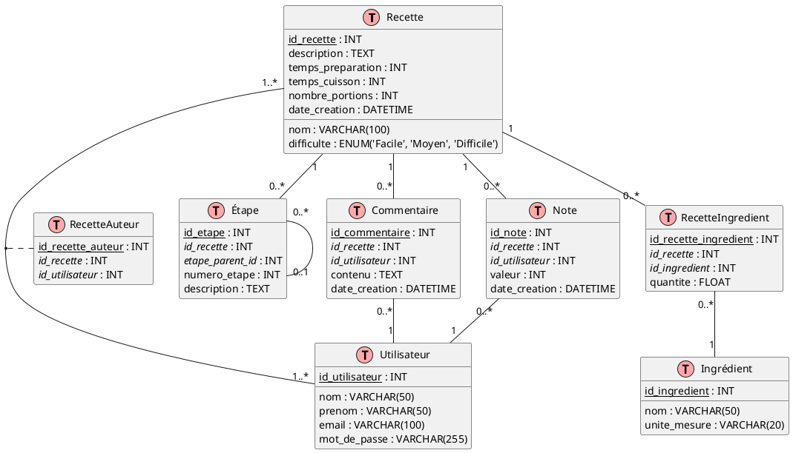

# 2. Recettes de cuisine

## Création

Voir le fichier [recettes_create.sql](../../src/create/recettes_create.sql).

## DEA

<details>
   <summary>Code</summary>



</details>


Ce diagramme représente une structure de base de données pour un site web de recettes avec les entités suivantes :

1. **Recette** : Contient les informations générales sur une recette.
2. **Utilisateur** : Représente les utilisateurs du site, qui peuvent être auteurs de recettes ou laisser des
   commentaires et des notes.
3. **Ingrédient** : Liste tous les ingrédients possibles.
4. **Étape** : Décrit les étapes de préparation d'une recette.
5. **Commentaire** : Stocke les commentaires des utilisateurs sur les recettes.
6. **Note** : Enregistre les notes d'appréciation données par les utilisateurs aux recettes.
7. **RecetteIngredient** : Table de liaison entre Recette et Ingrédient, permettant de spécifier les quantités.
8. **RecetteAuteur** : Table de liaison entre Recette et Utilisateur, permettant d'avoir plusieurs auteurs par recette.

## Requêtes

### Simple

#### 1. Trouver les recettes qui demandent un temps de préparation de moins de 30 minutes.

Difficulté : 1
<details>
    <summary>Code</summary>
    
```sql
SELECT nom, temps_preparation
FROM Recette
WHERE temps_preparation < 30
ORDER BY temps_preparation;
```
</details>
<br>

#### 2. Lister tous les ingrédients dont l'unité de mesure est en grammes (g).

Difficulté : 1
<details>
    <summary>Code</summary>
    
```sql
SELECT nom, unite_mesure
FROM Ingredient
WHERE unite_mesure = 'g'
ORDER BY nom;
```
</details>
<br>

#### 3. Afficher les utilisateurs dont le nom de famille commence par 'D'.

Difficulté : 1
<details>
    <summary>Code</summary>
    
```sql
SELECT nom, prenom, email
FROM Utilisateur
WHERE nom LIKE 'D%'
ORDER BY nom, prenom;
```
</details>
<br>

#### 4. Trouver les recettes classées comme "Difficile".

Difficulté : 1
<details>
    <summary>Code</summary>
    
```sql
SELECT nom, temps_preparation, temps_cuisson
FROM Recette
WHERE difficulte = 'Difficile'
ORDER BY nom;
```
</details>
<br>

#### 5. Lister les commentaires créés après le 1er janvier 2024.

Difficulté : 1
<details>
    <summary>Code</summary>
    
```sql
SELECT id_recette, contenu, date_creation
FROM Commentaire
WHERE date_creation > '2024-01-01'
ORDER BY date_creation DESC;
```
</details>
<br>

#### 6. Afficher le nom des recettes avec le nom et prénom de leur auteur.

Difficulté : 2
<details>
    <summary>Code</summary>
    
```sql
SELECT r.nom AS nom_recette, u.prenom, u.nom
FROM Recette r
         JOIN RecetteAuteur ra ON r.id_recette = ra.id_recette
         JOIN Utilisateur u ON ra.id_utilisateur = u.id_utilisateur
ORDER BY r.nom;
```
</details>
<br>

#### 7. Lister tous les ingrédients de la recette "Quiche Lorraine" avec leurs quantités.

Difficulté : 2
<details>
    <summary>Code</summary>
    
```sql
SELECT r.nom AS nom_recette, i.nom AS nom_ingredient, ri.quantite, i.unite_mesure
FROM Recette r
         JOIN RecetteIngredient ri ON r.id_recette = ri.id_recette
         JOIN Ingredient i ON ri.id_ingredient = i.id_ingredient
WHERE r.nom = 'Quiche Lorraine'
ORDER BY i.nom;
```
</details>
<br>

#### 8. Afficher toutes les étapes de préparation de la recette "Ratatouille" dans l'ordre.

Difficulté : 2
<details>
    <summary>Code</summary>
    
```sql
SELECT r.nom AS nom_recette, e.numero_etape, e.description
FROM Recette r
         JOIN Etape e ON r.id_recette = e.id_recette
WHERE r.nom = 'Ratatouille'
ORDER BY e.numero_etape;
```
</details>
<br>

#### 9. Trouver toutes les recettes avec leurs notes moyennes (si elles en ont).

Difficulté : 2
<details>
    <summary>Code</summary>
    
```sql
SELECT r.nom AS nom_recette, AVG(n.valeur) AS note_moyenne
FROM Recette r
         LEFT JOIN Note n ON r.id_recette = n.id_recette
GROUP BY r.id_recette, r.nom
ORDER BY note_moyenne DESC NULLS LAST;
```
</details>
<br>

#### 10. Lister tous les utilisateurs et le nombre de recettes qu'ils ont créées (y compris ceux qui n'en ont pas créé).

Difficulté : 2
<details>
    <summary>Code</summary>
    
```sql
SELECT u.prenom, u.nom, COUNT(ra.id_recette) AS nombre_recettes
FROM Utilisateur u
         LEFT JOIN RecetteAuteur ra ON u.id_utilisateur = ra.id_utilisateur
GROUP BY u.id_utilisateur, u.prenom, u.nom
ORDER BY nombre_recettes DESC;
```
</details>
<br>

#### 11. Afficher les recettes avec leurs commentaires, y compris celles sans commentaire.

Difficulté : 2
<details>
    <summary>Code</summary>
    
```sql
SELECT r.nom AS nom_recette, c.contenu AS commentaire
FROM Recette r
         LEFT JOIN Commentaire c ON r.id_recette = c.id_recette
ORDER BY r.nom, c.date_creation;
```
</details>
<br>

#### 12. Trouver les recettes qui utilisent de la "Farine" et leurs quantités.

Difficulté : 2
<details>
    <summary>Code</summary>
    
```sql
SELECT r.nom AS nom_recette, ri.quantite, i.unite_mesure
FROM Recette r
         JOIN RecetteIngredient ri ON r.id_recette = ri.id_recette
         JOIN Ingredient i ON ri.id_ingredient = i.id_ingredient
WHERE i.nom = 'Farine'
ORDER BY ri.quantite DESC;
```
</details>
<br>

#### 13. Lister les utilisateurs qui ont à la fois créé des recettes et laissé des commentaires.

Difficulté : 2
<details>
    <summary>Code</summary>
    
```sql
SELECT DISTINCT u.prenom, u.nom
FROM Utilisateur u
         JOIN RecetteAuteur ra ON u.id_utilisateur = ra.id_utilisateur
         JOIN Commentaire c ON u.id_utilisateur = c.id_utilisateur
ORDER BY u.nom, u.prenom;
```
</details>
<br>

#### 14. Afficher les recettes avec leur difficulté et le nom de leur auteur, triées par difficulté décroissante.

Difficulté : 2
<details>
    <summary>Code</summary>
    
```sql
SELECT r.nom AS nom_recette, r.difficulte, u.prenom, u.nom
FROM Recette r
         JOIN RecetteAuteur ra ON r.id_recette = ra.id_recette
         JOIN Utilisateur u ON ra.id_utilisateur = u.id_utilisateur
ORDER BY CASE
             WHEN r.difficulte = 'Difficile' THEN 1
             WHEN r.difficulte = 'Moyen' THEN 2
             WHEN r.difficulte = 'Facile' THEN 3
             END,
         r.nom;
```
</details>
<br>

#### 15. Trouver les recettes qui utilisent tous les ingrédients d'une salade niçoise (supposons que ce sont : (Thon, Olive, Oeufs).

Difficulté : 3
<details>
    <summary>Code</summary>
    
```sql
SELECT r.nom AS nom_recette
FROM Recette r
WHERE NOT EXISTS (SELECT i.id_ingredient
                  FROM Ingredient i
                  WHERE i.nom IN ('Thon', 'Olive', 'Oeufs')
                    AND NOT EXISTS (SELECT 1
                                    FROM RecetteIngredient ri
                                    WHERE ri.id_recette = r.id_recette
                                      AND ri.id_ingredient = i.id_ingredient))
ORDER BY r.nom;
```
</details>
<br>

#### 16. Calculer le nombre de recettes pour chaque niveau de difficulté.

Difficulté : 2
<details>
    <summary>Code</summary>
    
```sql
SELECT difficulte, COUNT(*) AS nombre_recettes
FROM Recette
GROUP BY difficulte
ORDER BY nombre_recettes DESC;
```
</details>
<br>

#### 17. Trouver le temps de préparation moyen des recettes pour chaque nombre de portions.

Difficulté : 2
<details>
    <summary>Code</summary>
    
```sql
SELECT nombre_portions, AVG(temps_preparation) AS temps_moyen_preparation
FROM Recette
GROUP BY nombre_portions
ORDER BY nombre_portions;
```
</details>
<br>

#### 18. Lister les unités de mesure utilisées et le nombre d'ingrédients pour chaque unité.

Difficulté : 2
<details>
    <summary>Code</summary>
    
```sql
SELECT unite_mesure, COUNT(*) AS nombre_ingredients
FROM Ingredient
GROUP BY unite_mesure
ORDER BY nombre_ingredients DESC;
```
</details>
<br>

#### 19. Trouver la note maximale, minimale et moyenne pour chaque recette.

Difficulté : 2
<details>
    <summary>Code</summary>
    
```sql
SELECT id_recette,
       MAX(valeur) AS note_max,
       MIN(valeur) AS note_min,
       AVG(valeur) AS note_moyenne
FROM Note
GROUP BY id_recette
ORDER BY note_moyenne DESC;
```
</details>
<br>

#### 20. Compter le nombre de commentaires par utilisateur.

Difficulté : 2
<details>
    <summary>Code</summary>
    
```sql
SELECT id_utilisateur, COUNT(*) AS nombre_commentaires
FROM Commentaire
GROUP BY id_utilisateur
ORDER BY nombre_commentaires DESC;
```
</details>
<br>

#### 21. Afficher le nom des recettes et le nombre d'ingrédients qu'elles contiennent.

Difficulté : 2
<details>
    <summary>Code</summary>
    
```sql
SELECT r.nom AS nom_recette, COUNT(ri.id_ingredient) AS nombre_ingredients
FROM Recette r
         LEFT JOIN RecetteIngredient ri ON r.id_recette = ri.id_recette
GROUP BY r.id_recette, r.nom
ORDER BY nombre_ingredients DESC;
```
</details>
<br>

#### 22. Trouver les utilisateurs qui ont créé le plus de recettes, avec le nombre de recettes créées.

Difficulté : 3
<details>
    <summary>Code</summary>
    
```sql
SELECT u.prenom, u.nom, COUNT(ra.id_recette) AS nombre_recettes
FROM Utilisateur u
         LEFT JOIN RecetteAuteur ra ON u.id_utilisateur = ra.id_utilisateur
GROUP BY u.id_utilisateur, u.prenom, u.nom
ORDER BY nombre_recettes DESC;
```
</details>
<br>

#### 23. Calculer le temps de préparation moyen des recettes pour chaque auteur.

Difficulté : 3
<details>
    <summary>Code</summary>
    
```sql
SELECT u.prenom, u.nom, AVG(r.temps_preparation) AS temps_moyen_preparation
FROM Utilisateur u
         JOIN RecetteAuteur ra ON u.id_utilisateur = ra.id_utilisateur
         JOIN Recette r ON ra.id_recette = r.id_recette
GROUP BY u.id_utilisateur, u.prenom, u.nom
ORDER BY temps_moyen_preparation DESC;
```
</details>
<br>

#### 24. Lister les ingrédients les plus utilisés dans les recettes, avec le nombre de recettes les utilisant.

Difficulté : 3
<details>
    <summary>Code</summary>
    
```sql
SELECT i.nom AS nom_ingredient, COUNT(DISTINCT ri.id_recette) AS nombre_recettes
FROM Ingredient i
         JOIN RecetteIngredient ri ON i.id_ingredient = ri.id_ingredient
GROUP BY i.id_ingredient, i.nom
ORDER BY nombre_recettes DESC LIMIT 10;
```
</details>
<br>

#### 25. Trouver la note moyenne des recettes pour chaque niveau de difficulté.

Difficulté : 3
<details>
    <summary>Code</summary>
    
```sql
SELECT r.difficulte, AVG(n.valeur) AS note_moyenne
FROM Recette r
         LEFT JOIN Note n ON r.id_recette = n.id_recette
GROUP BY r.difficulte
ORDER BY note_moyenne DESC;
```
</details>
<br>

#### 26. Trouver les recettes qui ont un temps de préparation supérieur à la moyenne.

Difficulté : 3
<details>
    <summary>Code</summary>
    
```sql
SELECT nom, temps_preparation
FROM Recette
WHERE temps_preparation > (SELECT AVG(temps_preparation)
                           FROM Recette)
ORDER BY temps_preparation DESC;
```
</details>
<br>

#### 27. Lister les utilisateurs qui ont créé des recettes, mais n'ont jamais laissé de commentaire.

Difficulté : 3
<details>
    <summary>Code</summary>
    
```sql
SELECT DISTINCT u.prenom, u.nom
FROM Utilisateur u
         JOIN RecetteAuteur ra ON u.id_utilisateur = ra.id_utilisateur
WHERE u.id_utilisateur NOT IN (SELECT DISTINCT id_utilisateur
                               FROM Commentaire)
ORDER BY u.nom, u.prenom;
```
</details>
<br>

#### 28. Trouver les recettes qui utilisent tous les ingrédients présents dans la recette "Quiche Lorraine".

Difficulté : 4
<details>
    <summary>Code</summary>
    
```sql
SELECT r.nom
FROM Recette r
WHERE NOT EXISTS (SELECT ri.id_ingredient
                  FROM RecetteIngredient ri
                           JOIN Recette q ON ri.id_recette = q.id_recette
                  WHERE q.nom = 'Quiche Lorraine'
                    AND ri.id_ingredient NOT IN (SELECT id_ingredient
                                                 FROM RecetteIngredient
                                                 WHERE id_recette = r.id_recette))
  AND r.nom != 'Quiche Lorraine'
ORDER BY r.nom;
```
</details>
<br>

#### 29. Afficher les recettes dont la note moyenne est supérieure à la note moyenne globale de toutes les recettes.

Difficulté : 3
<details>
    <summary>Code</summary>
    
```sql
SELECT r.nom, AVG(n.valeur) AS note_moyenne
FROM Recette r
         JOIN Note n ON r.id_recette = n.id_recette
GROUP BY r.id_recette, r.nom
HAVING AVG(n.valeur) > (SELECT AVG(valeur)
                        FROM Note)
ORDER BY note_moyenne DESC;
```
</details>
<br>

#### 30. Trouver les utilisateurs qui ont commenté toutes les recettes qu'ils ont créées.

Difficulté : 4
<details>
    <summary>Code</summary>
    
```sql
SELECT u.prenom, u.nom
FROM Utilisateur u
WHERE NOT EXISTS (SELECT ra.id_recette
                  FROM RecetteAuteur ra
                  WHERE ra.id_utilisateur = u.id_utilisateur
                    AND NOT EXISTS (SELECT c.id_commentaire
                                    FROM Commentaire c
                                    WHERE c.id_recette = ra.id_recette
                                      AND c.id_utilisateur = u.id_utilisateur))
  AND EXISTS (SELECT 1
              FROM RecetteAuteur ra
              WHERE ra.id_utilisateur = u.id_utilisateur)
ORDER BY u.nom, u.prenom;
```
</details>
<br>

#### 31. Lister les 3 recettes les plus commentées avec leur nombre de commentaires.

Difficulté : 3
<details>
    <summary>Code</summary>
    
```sql
WITH CommentCount AS (SELECT id_recette, COUNT(*) AS nb_commentaires
                      FROM Commentaire
                      GROUP BY id_recette)
SELECT r.nom, cc.nb_commentaires
FROM Recette r
         JOIN CommentCount cc ON r.id_recette = cc.id_recette
ORDER BY cc.nb_commentaires DESC LIMIT 3;
```
</details>
<br>

#### 32. Trouver les utilisateurs qui ont créé des recettes et laissé des commentaires, avec le nombre de recettes et de commentaires.

Difficulté : 3
<details>
    <summary>Code</summary>
    
```sql
WITH RecetteCount AS (SELECT id_utilisateur, COUNT(*) AS nb_recettes
                      FROM RecetteAuteur
                      GROUP BY id_utilisateur),
     CommentCount AS (SELECT id_utilisateur, COUNT(*) AS nb_commentaires
                      FROM Commentaire
                      GROUP BY id_utilisateur)
SELECT u.prenom,
       u.nom,
       COALESCE(rc.nb_recettes, 0)     AS nb_recettes,
       COALESCE(cc.nb_commentaires, 0) AS nb_commentaires
FROM Utilisateur u
         LEFT JOIN RecetteCount rc ON u.id_utilisateur = rc.id_utilisateur
         LEFT JOIN CommentCount cc ON u.id_utilisateur = cc.id_utilisateur
WHERE rc.nb_recettes > 0
   OR cc.nb_commentaires > 0
ORDER BY nb_recettes DESC, nb_commentaires DESC;
```
</details>
<br>

#### 33. Calculer le score total de chaque recette basé sur ses notes (5 points par note 5, 4 points par note 4, etc.) et afficher le top 5.

Difficulté : 4
<details>
    <summary>Code</summary>
    
```sql
WITH ScoreCalculation AS (SELECT id_recette,
                                 SUM(CASE
                                         WHEN valeur = 5 THEN 5
                                         WHEN valeur = 4 THEN 4
                                         WHEN valeur = 3 THEN 3
                                         WHEN valeur = 2 THEN 2
                                         WHEN valeur = 1 THEN 1
                                         ELSE 0
                                     END) AS score_total
                          FROM Note
                          GROUP BY id_recette)
SELECT r.nom, sc.score_total
FROM Recette r
         JOIN ScoreCalculation sc ON r.id_recette = sc.id_recette
ORDER BY sc.score_total DESC LIMIT 5;
```
</details>
<br>

#### 34. Trouver les "super utilisateurs" qui ont créé au moins 2 recettes et laissé au moins 3 commentaires.

Difficulté : 3
<details>
    <summary>Code</summary>
    
```sql
WITH UserActivity AS (SELECT u.id_utilisateur,
                             COUNT(DISTINCT ra.id_recette)    AS recettes_creees,
                             COUNT(DISTINCT c.id_commentaire) AS commentaires_laisses
                      FROM Utilisateur u
                               LEFT JOIN RecetteAuteur ra ON u.id_utilisateur = ra.id_utilisateur
                               LEFT JOIN Commentaire c ON u.id_utilisateur = c.id_utilisateur
                      GROUP BY u.id_utilisateur)
SELECT u.prenom, u.nom, ua.recettes_creees, ua.commentaires_laisses
FROM Utilisateur u
         JOIN UserActivity ua ON u.id_utilisateur = ua.id_utilisateur
WHERE ua.recettes_creees >= 2
  AND ua.commentaires_laisses >= 3
ORDER BY ua.recettes_creees DESC, ua.commentaires_laisses DESC;
```
</details>
<br>

#### 35. Créer une hiérarchie des étapes de recette, en supposant que chaque étape puisse avoir des sous-étapes (utilisation de `WITH RECURSIVE`).

Difficulté : 4
<details>
    <summary>Code</summary>
    
```sql
WITH RECURSIVE EtapeHierarchy AS (SELECT id_etape, id_recette, numero_etape, description, etape_parent_id, 0 AS niveau
                                  FROM Etape
                                  WHERE etape_parent_id IS NULL

                                  UNION ALL

                                  SELECT e.id_etape,
                                         e.id_recette,
                                         e.numero_etape,
                                         e.description,
                                         e.etape_parent_id,
                                         eh.niveau + 1
                                  FROM Etape e
                                           JOIN EtapeHierarchy eh ON e.etape_parent_id = eh.id_etape)
SELECT r.nom                                                             AS nom_recette,
       REPEAT('  ', niveau) || eh.numero_etape || '. ' || eh.description AS etape_detaillee
FROM EtapeHierarchy eh
         JOIN Recette r ON eh.id_recette = r.id_recette
ORDER BY r.nom, eh.id_recette, eh.niveau, eh.numero_etape;
```
</details>
<br>

#### 36. Lister tous les noms d'utilisateurs et de recettes dans une seule colonne, en indiquant s'il s'agit d'un utilisateur ou d'une recette.

Difficulté : 3
<details>
    <summary>Code</summary>
    
```sql
SELECT nom AS nom, 'Utilisateur' AS type
FROM Utilisateur
UNION
SELECT nom, 'Recette' AS type
FROM Recette
ORDER BY type, nom;
```
</details>
<br>

#### 37. Catégoriser les recettes en fonction de leur temps total de préparation (préparation + cuisson).

Difficulté : 3

Utilisation de `CASE WHEN`

- `'Rapide'`: < 30 minutes
- `'Moyen'`: >= 30 et < 60 minutes
- `'Long'`: >= 60 minutes

<details>
    <summary>Code</summary>
    
```sql
SELECT nom,
       temps_preparation + temps_cuisson AS temps_total,
       CASE
           WHEN temps_preparation + temps_cuisson < 30 THEN 'Rapide'
           WHEN temps_preparation + temps_cuisson BETWEEN 30 AND 60 THEN 'Moyen'
           ELSE 'Long'
           END                           AS categorie_temps
FROM Recette
ORDER BY temps_total;
```
</details>
<br>

#### 38. Lister chaque recette avec tous ses ingrédients concaténés dans une seule chaîne.

Difficulté : 3

Utilisation de `STRING_AGG`.

<details>
    <summary>Code</summary>
    
```sql
SELECT r.nom,
       STRING_AGG(i.nom, ', ' ORDER BY i.nom) AS ingredients
FROM Recette r
         JOIN RecetteIngredient ri ON r.id_recette = ri.id_recette
         JOIN Ingredient i ON ri.id_ingredient = i.id_ingredient
GROUP BY r.id_recette, r.nom
ORDER BY r.nom;
```
</details>
<br>

#### 39. Classer les recettes par difficulté et leur attribuer un rang basé sur leur temps de préparation.

Difficulté : 3

Utilisation des _"WINDOW FUNCTIONS"_.

<details>
    <summary>Code</summary>
    
```sql
SELECT nom,
       difficulte,
       temps_preparation,
       RANK() OVER (PARTITION BY difficulte ORDER BY temps_preparation) AS rang_temps_prep
FROM Recette
ORDER BY difficulte, rang_temps_prep;
```
</details>
<br>

#### 40. Pour chaque utilisateur, trouver sa recette la mieux notée.

Difficulté : 4

Utilisation de `LATERAL JOIN`

<details>
    <summary>Code</summary>
    
```sql
SELECT u.nom AS nom_utilisateur, best_recipe.nom AS meilleure_recette, avg_note
FROM Utilisateur u
         LEFT JOIN LATERAL (
    SELECT ra.id_utilisateur, r.nom, AVG(n.valeur) AS avg_note
    FROM RecetteAuteur ra
             JOIN Recette r ON ra.id_recette = r.id_recette
             LEFT JOIN Note n ON r.id_recette = n.id_recette
    WHERE ra.id_utilisateur = u.id_utilisateur
    GROUP BY ra.id_utilisateur, r.id_recette, r.nom
    ORDER BY avg_note DESC NULLS LAST
        LIMIT 1
    ) AS best_recipe
ON true
ORDER BY avg_note DESC NULLS LAST;
```
</details>
<br>

#### 41. Comparer le nombre de recettes créées et le nombre de commentaires laissés par chaque utilisateur, en incluant tous les utilisateurs.

Difficulté : 4

Utilisation de `FULL OUTER JOIN`

<details>
    <summary>Code</summary>
    
```sql
SELECT COALESCE(u1.nom, u2.nom)         AS nom_utilisateur,
       COUNT(DISTINCT ra.id_recette)    AS recettes_creees,
       COUNT(DISTINCT c.id_commentaire) AS commentaires_laisses
FROM (SELECT id_utilisateur, nom FROM Utilisateur) u1
         FULL OUTER JOIN RecetteAuteur ra ON u1.id_utilisateur = ra.id_utilisateur
         FULL OUTER JOIN (SELECT id_utilisateur, nom FROM Utilisateur) u2 ON u1.id_utilisateur = u2.id_utilisateur
         FULL OUTER JOIN Commentaire c ON u2.id_utilisateur = c.id_utilisateur
GROUP BY COALESCE(u1.id_utilisateur, u2.id_utilisateur), COALESCE(u1.nom, u2.nom)
ORDER BY recettes_creees DESC, commentaires_laisses DESC;
```
</details>
<br>

#### 42. Compter le nombre de recettes créées par mois au cours de la dernière année.

Difficulté : 3
<details>
    <summary>Code</summary>
    
```sql
SELECT DATE_TRUNC('month', date_creation) AS mois,
       COUNT(*)                           AS nombre_recettes
FROM Recette
WHERE date_creation >= CURRENT_DATE - INTERVAL '1 year'
GROUP BY DATE_TRUNC('month', date_creation)
ORDER BY mois;
```
</details>
<br>

#### 43. Calculer la note moyenne des recettes par saison.

Difficulté : 3
<details>
    <summary>Code</summary>
    
```sql
SELECT CASE
           WHEN EXTRACT(MONTH FROM n.date_creation) IN (12, 1, 2) THEN 'Hiver'
           WHEN EXTRACT(MONTH FROM n.date_creation) IN (3, 4, 5) THEN 'Printemps'
           WHEN EXTRACT(MONTH FROM n.date_creation) IN (6, 7, 8) THEN 'Été'
           ELSE 'Automne'
           END       AS saison,
       AVG(n.valeur) AS note_moyenne
FROM Note n
GROUP BY CASE
             WHEN EXTRACT(MONTH FROM n.date_creation) IN (12, 1, 2) THEN 'Hiver'
             WHEN EXTRACT(MONTH FROM n.date_creation) IN (3, 4, 5) THEN 'Printemps'
             WHEN EXTRACT(MONTH FROM n.date_creation) IN (6, 7, 8) THEN 'Été'
             ELSE 'Automne'
             END
ORDER BY note_moyenne DESC;
```
</details>
<br>

#### 44. Trouver le jour de la semaine où les utilisateurs laissent le plus de commentaires.

Difficulté : 3
<details>
    <summary>Code</summary>
    
```sql
SELECT TO_CHAR(date_creation, 'Day') AS jour_semaine,
       COUNT(*)                      AS nombre_commentaires
FROM Commentaire
GROUP BY TO_CHAR(date_creation, 'Day'), EXTRACT(DOW FROM date_creation)
ORDER BY EXTRACT(DOW FROM date_creation);
```
</details>
<br>

#### 45. Calculer le nombre moyen de recettes créées par mois pour chaque année.

Difficulté : 4
<details>
    <summary>Code</summary>
    
```sql
SELECT EXTRACT(YEAR FROM date_creation) AS annee,
       AVG(recettes_par_mois)           AS moyenne_recettes_par_mois
FROM (SELECT DATE_TRUNC('month', date_creation) AS mois,
             COUNT(*)                           AS recettes_par_mois
      FROM Recette
      GROUP BY DATE_TRUNC('month', date_creation)) AS sous_requete
GROUP BY EXTRACT(YEAR FROM mois)
ORDER BY annee;
```
</details>
<br>

#### 46. Identifier les utilisateurs qui ont été les plus actifs (en termes de commentaires) au cours des 30 derniers jours.

Difficulté : 3
<details>
    <summary>Code</summary>
    
```sql
SELECT u.nom,
       u.prenom,
       COUNT(*) AS nombre_commentaires
FROM Utilisateur u
         JOIN Commentaire c ON u.id_utilisateur = c.id_utilisateur
WHERE c.date_creation >= CURRENT_DATE - INTERVAL '30 days'
GROUP BY u.id_utilisateur, u.nom, u.prenom
ORDER BY nombre_commentaires DESC
    LIMIT 5;
```
</details>
<br>

#### 47. Comparer le nombre de recettes créées cette année par rapport à l'année précédente, par trimestre.

Difficulté : 4
<details>
    <summary>Code</summary>
    
```sql
WITH recettes_par_trimestre AS (SELECT EXTRACT(YEAR FROM date_creation)    AS annee,
                                       EXTRACT(QUARTER FROM date_creation) AS trimestre,
                                       COUNT(*)                            AS nombre_recettes
                                FROM Recette
                                WHERE (date_creation >= DATE_TRUNC('year', CURRENT_DATE) - INTERVAL '1 year')
                                GROUP BY EXTRACT(YEAR FROM date_creation), EXTRACT(QUARTER FROM date_creation))
SELECT r1.trimestre,
       r1.nombre_recettes AS recettes_annee_precedente,
       r2.nombre_recettes AS recettes_annee_courante
FROM recettes_par_trimestre r1
         LEFT JOIN recettes_par_trimestre r2
                   ON r1.trimestre = r2.trimestre AND r2.annee = EXTRACT(YEAR FROM CURRENT_DATE)
WHERE r1.annee = EXTRACT(YEAR FROM CURRENT_DATE) - 1
ORDER BY r1.trimestre;
```
</details>
<br>


-------
<small>
   <cite>
      **Note** : Page rédigée en partie avec l'aide d'un assistant IA, principalement
      à l'aide de Perplexity AI, avec les LLM `GPT-4 Omni` et `Claude 3.5 Sonnet`. L'IA
      a été utilisée pour générer des explications, des exemples et/ou des suggestions de
      structure. Toutes les informations ont été vérifiées, éditées et complétées par
      l'auteur.
   </cite>
</small>