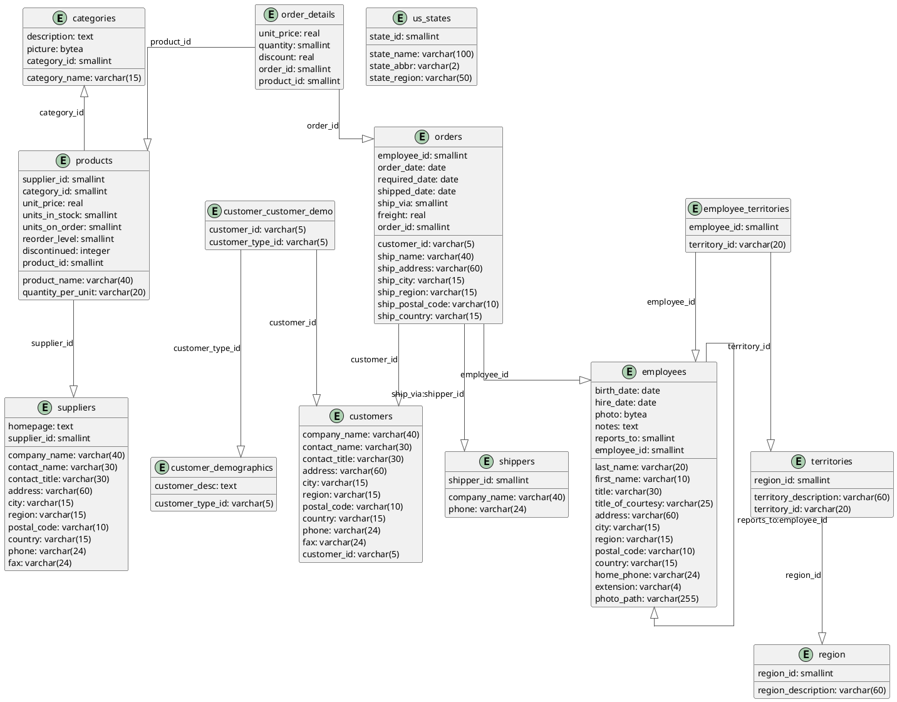

# 3. BD Northwind

## Création

[northwind_create.sql](../../src/create/northwind_create.sql)

## DEA

<details>
    <summary>Code</summary>



</details>


## Requêtes

Bien sûr, je vais vous proposer quelques questions simples basées sur le diagramme entité-association (DEA) de la base
de données Northwind que vous avez fourni. Ces questions se concentreront sur des requêtes impliquant une seule table,
sans jointures ni regroupements, mais avec la possibilité d'utiliser des fonctions d'agrégation. Je vais également
fournir les réponses sous forme de requêtes SQL pour PostgreSQL.

### 1. Listez tous les produits dont le prix unitaire est supérieur à 50.

Difficulté : 1
<details>
    <summary>Code</summary> 

```sql
SELECT product_name, unit_price
FROM products
WHERE unit_price > 50
ORDER BY unit_price DESC;
```
</details>
<br>

### 2. Combien y a-t-il d'employés au total dans l'entreprise ?

Difficulté : 1
<details>
    <summary>Code</summary>
    
```sql
SELECT COUNT(*) AS total_employees
FROM employees;
```
</details>
<br>

### 3. Quels sont les 5 produits les plus chers ?

Difficulté : 1
<details>
    <summary>Code</summary>
    
```sql
SELECT product_name, unit_price
FROM products
ORDER BY unit_price DESC
LIMIT 5;
```
</details>
<br>

Difficulté : 3
<details>
    <summary>Code</summary>
    
```sql
WITH ranked_products AS (SELECT product_name,
                                unit_price,
                                DENSE_RANK() OVER (ORDER BY unit_price DESC) as price_rank
                         FROM products)
SELECT product_name, unit_price
FROM ranked_products
WHERE price_rank <= 5
ORDER BY unit_price DESC, product_name;
```
</details>
<br>

### 4. Listez tous les clients basés en France.

Difficulté : 1
<details>
    <summary>Code</summary>
    
```sql
SELECT company_name, contact_name, city
FROM customers
WHERE country = 'France';
```
</details>
<br>

### 5. Quel est le prix moyen des produits ?

Difficulté : 1
<details>
    <summary>Code</summary>
    
```sql
SELECT AVG(unit_price) AS average_price
FROM products;
```
</details>
<br>

### 6. Listez tous les fournisseurs qui ne sont pas basés aux États-Unis.

Difficulté : 1
<details>
    <summary>Code</summary>
    
```sql
SELECT company_name, country
FROM suppliers
WHERE country != 'USA';
```
</details>
<br>

### 7. Combien de produits sont actuellement en rupture de stock ?

Difficulté : 1
<details>
    <summary>Code</summary>
    
```sql
SELECT COUNT(*) AS out_of_stock_products
FROM products
WHERE units_in_stock = 0;
```
</details>
<br>

### 8. Quels sont les employés embauchés après le 1er janvier 1993 ?

Difficulté : 1
<details>
    <summary>Code</summary>
    
```sql
SELECT first_name, last_name, hire_date
FROM employees
WHERE hire_date > '1993-01-01'
ORDER BY hire_date;
```
</details>
<br>

### 9. Quel est le produit le moins cher en stock ?

Difficulté : 1
<details>
    <summary>Code</summary>
    
```sql
SELECT product_name, unit_price
FROM products
WHERE units_in_stock > 0
ORDER BY unit_price ASC
LIMIT 1;
```
</details>
<br>

Difficulté : 2
<details>
    <summary>Code</summary>
    
```sql
SELECT product_name, unit_price
FROM products
WHERE units_in_stock > 0
  AND unit_price = (SELECT MIN(unit_price)
                    FROM products
                    WHERE units_in_stock > 0)
ORDER BY product_name;
```
</details>
<br>

### 10. Listez toutes les catégories de produits par ordre alphabétique.

Difficulté : 1
<details>
    <summary>Code</summary>
    
```sql
SELECT category_name
FROM categories
ORDER BY category_name ASC;
```
</details>
<br>

### 11. Listez tous les produits avec leur catégorie correspondante.

Difficulté : 2
<details>
    <summary>Code</summary>
    
```sql
SELECT p.product_name, c.category_name
FROM products p
         JOIN categories c ON p.category_id = c.category_id
ORDER BY c.category_name, p.product_name;
```
</details>
<br>

### 12. Affichez les noms des employés et les noms de leurs supérieurs directs.

Difficulté : 2
<details>
    <summary>Code</summary>
    
```sql
SELECT e.first_name || ' ' || e.last_name AS employee_name,
       m.first_name || ' ' || m.last_name AS manager_name
FROM employees e
         LEFT JOIN employees m ON e.reports_to = m.employee_id
ORDER BY manager_name, employee_name;
```
</details>
<br>

### 13. Listez tous les clients avec leurs commandes, y compris ceux qui n'ont pas encore passé de commande.

Difficulté : 2
<details>
    <summary>Code</summary>
    
```sql
SELECT c.company_name, o.order_id, o.order_date
FROM customers c
         LEFT JOIN orders o ON c.customer_id = o.customer_id
ORDER BY c.company_name, o.order_date;
```
</details>
<br>

### 14. Affichez les détails des produits commandés dans la commande numéro 10248.

Difficulté : 2
<details>
    <summary>Code</summary>
    
```sql
SELECT p.product_name, od.quantity, od.unit_price
FROM order_details od
         JOIN products p ON od.product_id = p.product_id
WHERE od.order_id = 10248
ORDER BY p.product_name;
```
</details>
<br>

### 15. Listez tous les employés avec leurs territoires assignés.

Difficulté : 2
<details>
    <summary>Code</summary>
    
```sql
SELECT e.first_name || ' ' || e.last_name AS employee_name,
       t.territory_description
FROM employees e
         JOIN employee_territories et ON e.employee_id = et.employee_id
         JOIN territories t ON et.territory_id = t.territory_id
ORDER BY employee_name, t.territory_description;
```
</details>
<br>

### 16. Affichez les noms des fournisseurs et les noms des produits qu'ils fournissent pour la catégorie 'Beverages'.

Difficulté : 3
<details>
    <summary>Code</summary>
    
```sql
SELECT s.company_name AS supplier_name, p.product_name
FROM suppliers s
         JOIN products p ON s.supplier_id = p.supplier_id
         JOIN categories c ON p.category_id = c.category_id
WHERE c.category_name = 'Beverages'
ORDER BY s.company_name, p.product_name;
```
</details>
<br>

### 17. Listez toutes les commandes passées par le client 'QUICK-Stop' en 1997.

Difficulté : 2
<details>
    <summary>Code</summary>
    
```sql
SELECT o.order_id, o.order_date, e.first_name || ' ' || e.last_name AS employee_name
FROM orders o
         JOIN customers c ON o.customer_id = c.customer_id
         JOIN employees e ON o.employee_id = e.employee_id
WHERE c.company_name = 'QUICK-Stop'
  AND EXTRACT(YEAR FROM o.order_date) = 1997
ORDER BY o.order_date;
```
</details>
<br>

### 18. Affichez les produits et leurs fournisseurs pour tous les produits qui sont en rupture de stock.

Difficulté : 2
<details>
    <summary>Code</summary>
    
```sql
SELECT p.product_name, s.company_name AS supplier_name, p.units_in_stock
FROM products p
         JOIN suppliers s ON p.supplier_id = s.supplier_id
WHERE p.units_in_stock = 0
ORDER BY s.company_name, p.product_name;
```
</details>
<br>

### 19. Listez tous les employés et le nombre de territoires qui leur sont assignés.

Difficulté : 2
<details>
    <summary>Code</summary>
    
```sql
SELECT e.first_name || ' ' || e.last_name AS employee_name,
       COUNT(et.territory_id)             AS territory_count
FROM employees e
         LEFT JOIN employee_territories et ON e.employee_id = et.employee_id
GROUP BY e.employee_id, employee_name
ORDER BY employee_name;
```
</details>
<br>

### 20. Affichez les détails de la commande la plus récente pour chaque client.

Difficulté : 3
<details>
    <summary>Code</summary>
    
```sql
WITH latest_orders AS (SELECT customer_id, MAX(order_date) AS max_order_date
                       FROM orders
                       GROUP BY customer_id)
SELECT c.company_name, o.order_id, o.order_date
FROM customers c
         JOIN latest_orders lo ON c.customer_id = lo.customer_id
         JOIN orders o ON lo.customer_id = o.customer_id AND lo.max_order_date = o.order_date
ORDER BY c.company_name;
```
</details>
<br>

### 21. Calculez le nombre total de commandes par client.

Difficulté : 2
<details>
    <summary>Code</summary>
    
```sql
SELECT c.company_name, COUNT(o.order_id) AS total_orders
FROM customers c
         LEFT JOIN orders o ON c.customer_id = o.customer_id
GROUP BY c.customer_id, c.company_name
ORDER BY total_orders DESC;
```
</details>
<br>

### 22. Trouvez le chiffre d'affaires total par catégorie de produits.

Difficulté : 3
<details>
    <summary>Code</summary>
    
```sql
SELECT c.category_name, TRUNC(SUM(od.quantity * od.unit_price * (1 - od.discount))::numeric, 2) AS total_revenue
FROM categories c
         JOIN products p ON c.category_id = p.category_id
         JOIN order_details od ON p.product_id = od.product_id
GROUP BY c.category_id, c.category_name
ORDER BY total_revenue DESC;
```
</details>
<br>

### 23. Listez les employés et le nombre de commandes qu'ils ont gérées en 1997.

Difficulté : 3
<details>
    <summary>Code</summary>
    
```sql
SELECT e.first_name || ' ' || e.last_name AS employee_name, COUNT(o.order_id) AS orders_handled
FROM employees e
         LEFT JOIN orders o ON e.employee_id = o.employee_id AND EXTRACT(YEAR FROM o.order_date) = 1997
GROUP BY e.employee_id, employee_name
ORDER BY orders_handled DESC;
```
</details>
<br>

### 24. Calculez le prix moyen des produits par fournisseur.

Difficulté : 2
<details>
    <summary>Code</summary>
    
```sql
SELECT s.company_name AS supplier_name, TRUNC(AVG(p.unit_price)::numeric, 2) AS average_price
FROM suppliers s
         JOIN products p ON s.supplier_id = p.supplier_id
GROUP BY s.supplier_id, s.company_name
ORDER BY average_price DESC;
```
</details>
<br>

### 25. Trouvez les 5 produits les plus vendus en termes de quantité.

Difficulté : 2
<details>
    <summary>Code</summary>
    
```sql
SELECT p.product_name, SUM(od.quantity) AS total_quantity_sold
FROM products p
         JOIN order_details od ON p.product_id = od.product_id
GROUP BY p.product_id, p.product_name
ORDER BY total_quantity_sold DESC
LIMIT 5;
```
</details>
<br>

Difficulté : 3
<details>
    <summary>Code</summary>
    
```sql
WITH product_sales AS (SELECT p.product_id, p.product_name, SUM(od.quantity) AS total_quantity_sold
                       FROM products p
                                JOIN order_details od ON p.product_id = od.product_id
                       GROUP BY p.product_id, p.product_name),
     ranked_products AS (SELECT product_id,
                                product_name,
                                total_quantity_sold,
                                DENSE_RANK() OVER (ORDER BY total_quantity_sold DESC) AS sales_rank
                         FROM product_sales)
SELECT product_id, product_name, total_quantity_sold
FROM ranked_products
WHERE sales_rank <= 5
ORDER BY total_quantity_sold DESC, product_name;
```
</details>
<br>

### 26. Calculez le nombre moyen de jours entre la date de commande et la date d'expédition pour chaque transporteur.

Difficulté : 3
<details>
    <summary>Code</summary>
    
```sql
SELECT s.company_name                               AS shipper_name,
       ROUND(AVG(o.shipped_date - o.order_date), 2) AS avg_shipping_days
FROM shippers s
         JOIN orders o ON s.shipper_id = o.ship_via
WHERE o.shipped_date IS NOT NULL
GROUP BY s.shipper_id, s.company_name
ORDER BY avg_shipping_days;
```
</details>
<br>

### 27. Identifiez les clients qui ont passé des commandes totalisant plus de 10000 en valeur.

Difficulté : 3
<details>
    <summary>Code</summary>
    
```sql
SELECT c.company_name,
       TRUNC(SUM(od.quantity * od.unit_price * (1 - od.discount))::numeric, 2) AS total_order_value
FROM customers c
         JOIN orders o ON c.customer_id = o.customer_id
         JOIN order_details od ON o.order_id = od.order_id
GROUP BY c.customer_id, c.company_name
HAVING SUM(od.quantity * od.unit_price * (1 - od.discount)) > 10000
ORDER BY total_order_value DESC;
```
</details>
<br>

### 28. Calculez le nombre de produits différents commandés par chaque client.

Difficulté : 3
<details>
    <summary>Code</summary>
    
```sql
SELECT c.company_name, COUNT(DISTINCT od.product_id) AS unique_products_ordered
FROM customers c
         JOIN orders o ON c.customer_id = o.customer_id
         JOIN order_details od ON o.order_id = od.order_id
GROUP BY c.customer_id, c.company_name
ORDER BY unique_products_ordered DESC;
```
</details>
<br>

### 29. Trouvez le chiffre d'affaires total par année et par mois.

Difficulté : 3
<details>
    <summary>Code</summary>
    
```sql
SELECT EXTRACT(YEAR FROM o.order_date)                                         AS year,
       EXTRACT(MONTH FROM o.order_date)                                        AS month,
       TRUNC(SUM(od.quantity * od.unit_price * (1 - od.discount))::numeric, 2) AS total_revenue
FROM orders o
         JOIN order_details od ON o.order_id = od.order_id
GROUP BY EXTRACT(YEAR FROM o.order_date), EXTRACT(MONTH FROM o.order_date)
ORDER BY year, month;
```
</details>
<br>

### 30. Identifiez les catégories de produits qui ont généré le plus de revenus par région.

Difficulté : 4
<details>
    <summary>Code</summary>
    
```sql
SELECT c.category_name,
       r.region_description,
       TRUNC(SUM(od.quantity * od.unit_price * (1 - od.discount))::numeric, 2) AS total_revenue
FROM categories c
         JOIN products p ON c.category_id = p.category_id
         JOIN order_details od ON p.product_id = od.product_id
         JOIN orders o ON od.order_id = o.order_id
         JOIN customers cu ON o.customer_id = cu.customer_id
         JOIN employees e ON o.employee_id = e.employee_id
         JOIN employee_territories et ON e.employee_id = et.employee_id
         JOIN territories t ON et.territory_id = t.territory_id
         JOIN region r ON t.region_id = r.region_id
GROUP BY c.category_id, c.category_name, r.region_id, r.region_description
ORDER BY r.region_description, total_revenue DESC;
```
</details>
<br>

### 31. Trouvez les produits qui n'ont jamais été commandés.

Difficulté : 2
<details>
    <summary>Code</summary>
    
```sql
SELECT p.product_id, p.product_name
FROM products p
         LEFT JOIN order_details od ON p.product_id = od.product_id
WHERE od.order_id IS NULL
ORDER BY p.product_id;
```
</details>
<br>

### 32. Calculez le rang des employés en fonction du nombre de commandes qu'ils ont gérées.

Difficulté : 3
<details>
    <summary>Code</summary>
    
```sql
SELECT e.employee_id,
       e.first_name || ' ' || e.last_name            AS employee_name,
       COUNT(o.order_id)                             AS order_count,
       RANK() OVER (ORDER BY COUNT(o.order_id) DESC) AS employee_rank
FROM employees e
         LEFT JOIN orders o ON e.employee_id = o.employee_id
GROUP BY e.employee_id, employee_name
ORDER BY employee_rank, employee_name;
```
</details>
<br>

### 33. Identifiez les clients qui ont commandé tous les produits d'une catégorie spécifique (par exemple, 'Beverages').

Difficulté : 4
<details>
    <summary>Code</summary>
    
```sql
WITH beverage_products AS (SELECT product_id
                           FROM products
                                    JOIN categories ON products.category_id = categories.category_id
                           WHERE category_name = 'Beverages')
SELECT c.customer_id, c.company_name
FROM customers c
WHERE NOT EXISTS (SELECT bp.product_id
                  FROM beverage_products bp
                  WHERE NOT EXISTS (SELECT 1
                                    FROM orders o
                                             JOIN order_details od ON o.order_id = od.order_id
                                    WHERE o.customer_id = c.customer_id
                                      AND od.product_id = bp.product_id))
ORDER BY c.company_name;
```
</details>
<br>

### 34. Calculez la moyenne mobile sur 3 mois des ventes totales.

Difficulté : 4
<details>
    <summary>Code</summary>
    
```sql
WITH monthly_sales AS (SELECT DATE_TRUNC('month', o.order_date)                    AS sale_month,
                              SUM(od.quantity * od.unit_price * (1 - od.discount)) AS total_sales
                       FROM orders o
                                JOIN
                            order_details od ON o.order_id = od.order_id
                       GROUP BY DATE_TRUNC('month', o.order_date))
SELECT sale_month,
       total_sales,
       AVG(total_sales) OVER (
           ORDER BY sale_month
           ROWS BETWEEN 2 PRECEDING AND CURRENT ROW
           ) AS moving_average
FROM monthly_sales
ORDER BY sale_month;
```
</details>
<br>

### 35. Trouvez les paires de produits qui sont toujours commandés ensemble.

Difficulté : 5
<details>
    <summary>Code</summary>
    
```sql
WITH product_pairs AS (SELECT od1.product_id               AS product1_id,
                              od2.product_id               AS product2_id,
                              COUNT(DISTINCT od1.order_id) AS order_count
                       FROM order_details od1
                                JOIN
                            order_details od2 ON od1.order_id = od2.order_id AND od1.product_id < od2.product_id
                       GROUP BY od1.product_id, od2.product_id)
SELECT p1.product_name AS product1_name,
       p2.product_name AS product2_name,
       pp.order_count
FROM product_pairs pp
         JOIN
     products p1 ON pp.product1_id = p1.product_id
         JOIN
     products p2 ON pp.product2_id = p2.product_id
WHERE pp.order_count = (SELECT COUNT(DISTINCT order_id) FROM orders)
ORDER BY p1.product_name, p2.product_name;
```
</details>
<br>

### 36. Calculez le pourcentage de contribution de chaque produit au chiffre d'affaires total.

Difficulté : 4
<details>
    <summary>Code</summary>
    
```sql
WITH product_sales AS (SELECT p.product_id,
                              p.product_name,
                              SUM(od.quantity * od.unit_price * (1 - od.discount)) AS product_revenue
                       FROM products p
                                JOIN
                            order_details od ON p.product_id = od.product_id
                       GROUP BY p.product_id, p.product_name),
     total_sales AS (SELECT SUM(product_revenue) AS total_revenue
                     FROM product_sales)
SELECT ps.product_name,
       ps.product_revenue,
       ROUND((ps.product_revenue / ts.total_revenue * 100)::numeric, 2) AS revenue_percentage
FROM product_sales ps
         CROSS JOIN
     total_sales ts
ORDER BY revenue_percentage DESC;
```
</details>
<br>

### 37. Identifiez les clients qui ont augmenté leurs achats d'une année à l'autre.

Difficulté : 4
<details>
    <summary>Code</summary>
    
```sql
WITH yearly_customer_purchases AS (SELECT c.customer_id,
                                          c.company_name,
                                          EXTRACT(YEAR FROM o.order_date)                      AS order_year,
                                          SUM(od.quantity * od.unit_price * (1 - od.discount)) AS total_purchase
                                   FROM customers c
                                            JOIN
                                        orders o ON c.customer_id = o.customer_id
                                            JOIN
                                        order_details od ON o.order_id = od.order_id
                                   GROUP BY c.customer_id, c.company_name, EXTRACT(YEAR FROM o.order_date))
SELECT ycp1.customer_id,
       ycp1.company_name,
       ycp1.order_year                                                                              AS year1,
       ycp1.total_purchase                                                                          AS purchase_year1,
       ycp2.order_year                                                                              AS year2,
       ycp2.total_purchase                                                                          AS purchase_year2,
       TRUNC(((ycp2.total_purchase - ycp1.total_purchase) / ycp1.total_purchase * 100)::numeric, 2) AS growth_percentage
FROM yearly_customer_purchases ycp1
         JOIN
     yearly_customer_purchases ycp2 ON ycp1.customer_id = ycp2.customer_id AND ycp2.order_year = ycp1.order_year + 1
WHERE ycp2.total_purchase > ycp1.total_purchase
ORDER BY growth_percentage DESC;
```
</details>
<br>

### 38. Trouvez la séquence la plus longue de jours consécutifs avec des commandes.

Difficulté : 4
<details>
    <summary>Code</summary>
    
```sql
WITH date_diff AS (SELECT order_date,
                          order_date - LAG(order_date) OVER (ORDER BY order_date) AS diff
                   FROM orders),
     sequences AS (SELECT order_date,
                          SUM(CASE WHEN diff = 1 THEN 0 ELSE 1 END) OVER (ORDER BY order_date) AS seq
                   FROM date_diff)
SELECT MIN(order_date) AS start_date,
       MAX(order_date) AS end_date,
       COUNT(*)        AS consecutive_days
FROM sequences
GROUP BY seq
ORDER BY consecutive_days DESC
LIMIT 1;
```
</details>
<br>

Difficulté : 5
<details>
    <summary>Code</summary>
    
```sql
WITH date_diff AS (SELECT order_date,
                          order_date - LAG(order_date) OVER (ORDER BY order_date) AS diff
                   FROM orders),
     sequences AS (SELECT order_date,
                          SUM(CASE WHEN diff = 1 THEN 0 ELSE 1 END) OVER (ORDER BY order_date) AS seq
                   FROM date_diff),
     sequence_lengths AS (SELECT seq,
                                 MIN(order_date) AS start_date,
                                 MAX(order_date) AS end_date,
                                 COUNT(*)        AS consecutive_days
                          FROM sequences
                          GROUP BY seq),
     max_length AS (SELECT MAX(consecutive_days) AS max_consecutive_days
                    FROM sequence_lengths)
SELECT sl.start_date,
       sl.end_date,
       sl.consecutive_days
FROM sequence_lengths sl
         JOIN
     max_length ml ON sl.consecutive_days = ml.max_consecutive_days
ORDER BY sl.start_date;
```
</details>
<br>

### 39. Calculez le temps moyen entre les commandes pour chaque client.

Difficulté : 4
<details>
    <summary>Code</summary>
    
```sql
WITH customer_order_dates AS (SELECT customer_id,
                                     order_date,
                                     LAG(order_date) OVER (PARTITION BY customer_id ORDER BY order_date) AS prev_order_date
                              FROM orders)
SELECT c.customer_id,
       c.company_name,
       ROUND(AVG(cod.order_date - cod.prev_order_date)::numeric, 2) AS avg_days_between_orders
FROM customers c
         JOIN
     customer_order_dates cod ON c.customer_id = cod.customer_id
WHERE cod.prev_order_date IS NOT NULL
GROUP BY c.customer_id, c.company_name
ORDER BY avg_days_between_orders;
```
</details>
<br>

### 40. Identifiez les produits dont les ventes ont augmenté chaque mois sur une période d'au moins 3 mois consécutifs.

Difficulté : 5
<details>
    <summary>Code</summary>
    
```sql
WITH monthly_product_sales AS (SELECT p.product_id,
                                      p.product_name,
                                      DATE_TRUNC('month', o.order_date)                    AS sale_month,
                                      SUM(od.quantity * od.unit_price * (1 - od.discount)) AS monthly_sales
                               FROM products p
                                        JOIN
                                    order_details od ON p.product_id = od.product_id
                                        JOIN
                                    orders o ON od.order_id = o.order_id
                               GROUP BY p.product_id, p.product_name, DATE_TRUNC('month', o.order_date)),
     sales_growth AS (SELECT product_id,
                             product_name,
                             sale_month,
                             monthly_sales,
                             LAG(monthly_sales) OVER (PARTITION BY product_id ORDER BY sale_month) AS prev_month_sales,
                             CASE
                                 WHEN monthly_sales >
                                      LAG(monthly_sales) OVER (PARTITION BY product_id ORDER BY sale_month) THEN 1
                                 ELSE 0
                                 END                                                               AS is_increase
                      FROM monthly_product_sales),
     consecutive_increases AS (SELECT product_id,
                                      product_name,
                                      sale_month,
                                      monthly_sales,
                                      SUM(CASE WHEN is_increase = 0 THEN 1 ELSE 0 END)
                                      OVER (PARTITION BY product_id ORDER BY sale_month) AS grp
                               FROM sales_growth
                               WHERE is_increase = 1)
SELECT DISTINCT product_id,
                product_name
FROM (SELECT product_id,
             product_name,
             grp,
             COUNT(*) OVER (PARTITION BY product_id, grp) AS consecutive_count
      FROM consecutive_increases) subq
WHERE consecutive_count >= 3
ORDER BY product_id;
```
</details>
<br>


-------
<small>
   <cite>
      **Note** : Page rédigée en partie avec l'aide d'un assistant IA, principalement
      à l'aide de Perplexity AI, avec les LLM `GPT-4 Omni` et `Claude 3.5 Sonnet`. L'IA
      a été utilisée pour générer des explications, des exemples et/ou des suggestions de
      structure. Toutes les informations ont été vérifiées, éditées et complétées par
      l'auteur.
   </cite>
</small>
